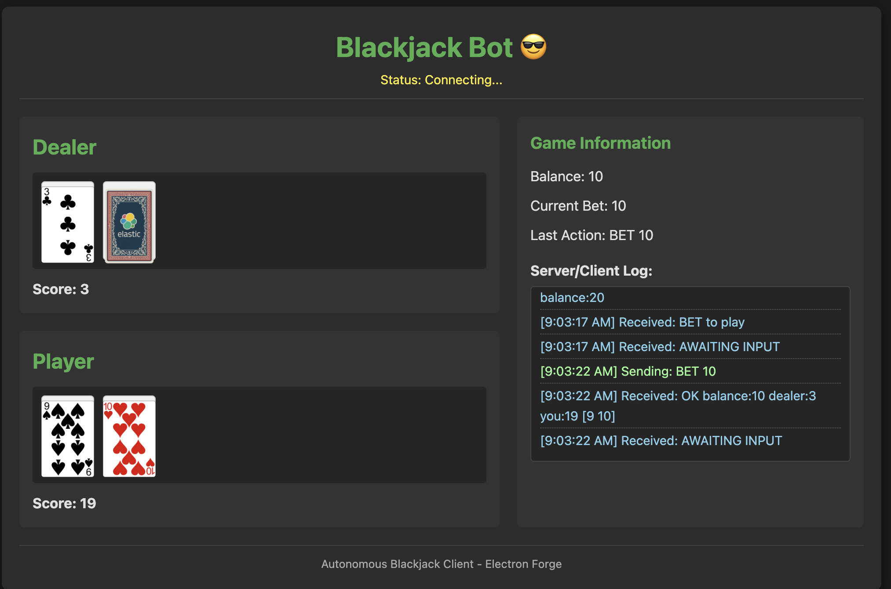

# Blackjack Client

A desktop application for playing Blackjack, built with Electron and modern web technologies.

## Project Structure

```
blackjack-client/
├── src/                    # Source code
│   ├── core/              # Core game logic and business rules
│   ├── renderer/          # Frontend UI components and views
│   ├── main.js            # Main Electron process
│   └── preload.js         # Preload script for secure IPC
├── .webpack/              # Webpack build output
├── webpack.*.config.js    # Webpack configuration files
├── forge.config.js        # Electron Forge configuration
└── package.json           # Project dependencies and scripts
```

## Documentation

The project includes several documentation files in the root directory:
- `protocol.md` - Communication protocol specifications
- `implementation.md` - Implementation details and architecture
- `http.md` - HTTP API documentation
- `workflow_state.md` - Development workflow and state management

## Tech Stack

- **Electron** - Desktop application framework
- **Webpack** - Module bundler
- **Electron Forge** - Build and packaging tools

## Development

### Prerequisites

- Node.js (Latest LTS version recommended)
- npm (comes with Node.js)

### Installation

1. Clone the repository
2. Install dependencies:
   ```bash
   cd blackjack-client
   npm install
   ```

### Available Scripts

- `npm start` - Start the application in development mode
- `npm run package` - Package the application
- `npm run make` - Create distributables
- `npm run publish` - Publish the application

## Building

The application uses Electron Forge for building and packaging. To create a distributable:

```bash
npm run make
```

This will create platform-specific distributables in the `out` directory.

# Screenshot



## License

MIT License - See LICENSE file for details

## Author

Nick Clark (nicholas.clark@elastic.co) 